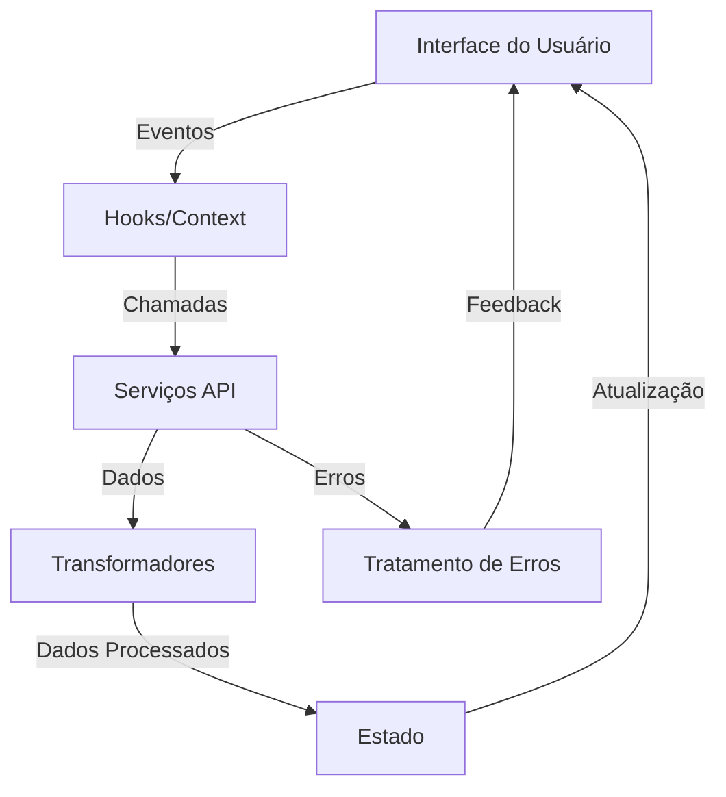

## Arquitetura do Sistema

### Visão Geral

O Taiga Report Generator é uma aplicação frontend que se integra com a API do Taiga para gerar relatórios personalizados. A arquitetura foi projetada para ser modular, escalável e de fácil manutenção.

### Componentes Principais

1. **Interface do Usuário (UI)**
   - **Tecnologias:**
     - React 18.3.1 (Framework principal)
     - TypeScript 5.5.3 (Tipagem estática)
     - Tailwind CSS 3.4.1 (Estilização)
     - Lucide React 0.344.0 (Ícones)
     - React Router DOM 6.22.3 (Roteamento)
   
   - **Estrutura de Pastas:**
     ```
     src/
     ├── pages/
     │   ├── LandingPage/
     │   │   ├── index.tsx        # Página inicial
     │   │   └── styles.css       # Estilos específicos
     │   ├── ReportGenerator/
     │   │   ├── components/      # Componentes específicos
     │   │   ├── hooks/          # Hooks customizados
     │   │   └── index.tsx       # Página do gerador
     │   └── ApiTester/
     │       ├── components/     # Componentes do testador
     │       └── index.tsx      # Página de testes
     ├── components/            # Componentes compartilhados
     │   ├── Button/
     │   ├── Input/
     │   └── Layout/
     └── assets/               # Recursos estáticos
         ├── images/
         └── styles/
     

2. **Gerenciamento de Estado**
   - **Tecnologias:**
     - React Hooks (useState, useEffect, useContext)
     - Custom Hooks para lógica reutilizável
   
   - **Estrutura de Pastas:**
     ```
     src/
     ├── hooks/
     │   ├── useAuth.ts         # Hook de autenticação
     │   ├── useApi.ts          # Hook de chamadas API
     │   └── useReport.ts       # Hook de geração de relatórios
     └── context/
         ├── AuthContext.tsx    # Contexto de autenticação
         └── ApiContext.tsx     # Contexto de estado da API
     ```

3. **Camada de Serviços**
   - **Tecnologias:**
     - Axios 1.6.7 (Cliente HTTP)
     - date-fns 3.3.1 (Manipulação de datas)
   
   - **Estrutura de Pastas:**
     ```
     src/
     ├── services/
     │   ├── api/
     │   │   ├── taigaApi.ts    # Cliente API Taiga
     │   │   └── config.ts      # Configurações do Axios
     │   └── report/
     │       └── generator.ts   # Geração de relatórios
     └── utils/
         ├── date.ts           # Utilitários de data
         ├── csv.ts           # Geração de CSV
         └── validation.ts    # Validações
     ```

4. **Processamento de Dados**
   - **Tecnologias:**
     - TypeScript (Tipagem e interfaces)
     - File System API (Download de arquivos)
   
   - **Estrutura de Pastas:**
     ```
     src/
     ├── types/
     │   ├── api.ts           # Tipos da API
     │   └── report.ts        # Tipos de relatório
     └── transformers/
         ├── userStory.ts     # Transformação de dados
         └── comments.ts      # Processamento de comentários
     ```

### Ferramentas de Desenvolvimento

1. **Build e Desenvolvimento**
   - Vite 5.4.2 (Bundler)
   - @vitejs/plugin-react 4.3.1 (Plugin React)
   - ESLint 9.9.1 (Linting)
   - PostCSS 8.4.35 (Processamento CSS)
   - Autoprefixer 10.4.18 (Prefixos CSS)

2. **Testes e Qualidade**
   - TypeScript ESLint 8.3.0
   - eslint-plugin-react-hooks 5.1.0-rc.0
   - eslint-plugin-react-refresh 0.4.11

### Fluxo de Dados



### Segurança

1. **Autenticação**
   - Token JWT armazenado em memória
   - Renovação automática de token
   - Validação de sessão

2. **Comunicação**
   - HTTPS obrigatório
   - Rate limiting
   - Timeout configurável

### Performance

1. **Otimizações**
   - Code splitting automático (Vite)
   - Lazy loading de rotas
   - Caching de requisições
   - Compressão de assets

2. **Monitoramento**
   - Console logging em desenvolvimento
   - Tratamento de erros centralizado
   - Feedback visual de progresso
