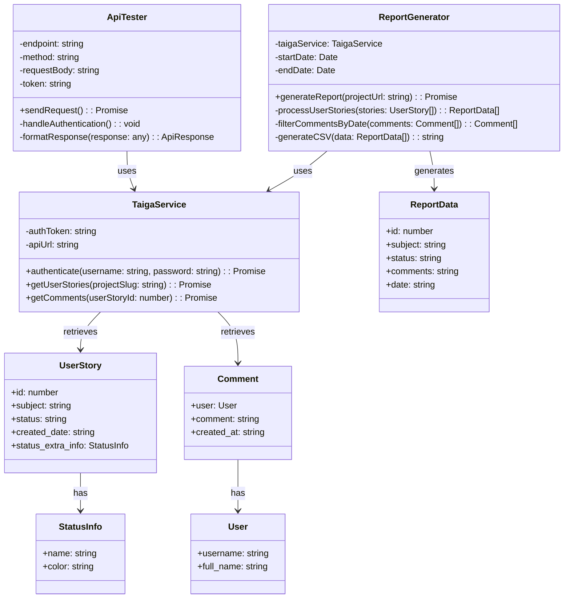

## Diagrama de Classes

```mermaid
classDiagram
    class TaigaService {
        -authToken: string
        -apiUrl: string
        +authenticate(username: string, password: string): Promise<void>
        +getUserStories(projectSlug: string): Promise<UserStory[]>
        +getComments(userStoryId: number): Promise<Comment[]>
    }

    class ReportGenerator {
        -taigaService: TaigaService
        -startDate: Date
        -endDate: Date
        +generateReport(projectUrl: string): Promise<string>
        -processUserStories(stories: UserStory[]): ReportData[]
        -filterCommentsByDate(comments: Comment[]): Comment[]
        -generateCSV(data: ReportData[]): string
    }

    class ApiTester {
        -endpoint: string
        -method: string
        -requestBody: string
        -token: string
        +sendRequest(): Promise<ApiResponse>
        -handleAuthentication(): void
        -formatResponse(response: any): ApiResponse
    }

    class UserStory {
        +id: number
        +subject: string
        +status: string
        +created_date: string
        +status_extra_info: StatusInfo
    }

    class Comment {
        +user: User
        +comment: string
        +created_at: string
    }

    class User {
        +username: string
        +full_name: string
    }

    class StatusInfo {
        +name: string
        +color: string
    }

    class ReportData {
        +id: number
        +subject: string
        +status: string
        +comments: string
        +date: string
    }

    TaigaService --> UserStory : retrieves
    TaigaService --> Comment : retrieves
    ReportGenerator --> TaigaService : uses
    ReportGenerator --> ReportData : generates
    UserStory --> StatusInfo : has
    Comment --> User : has
    ApiTester --> TaigaService : uses
```