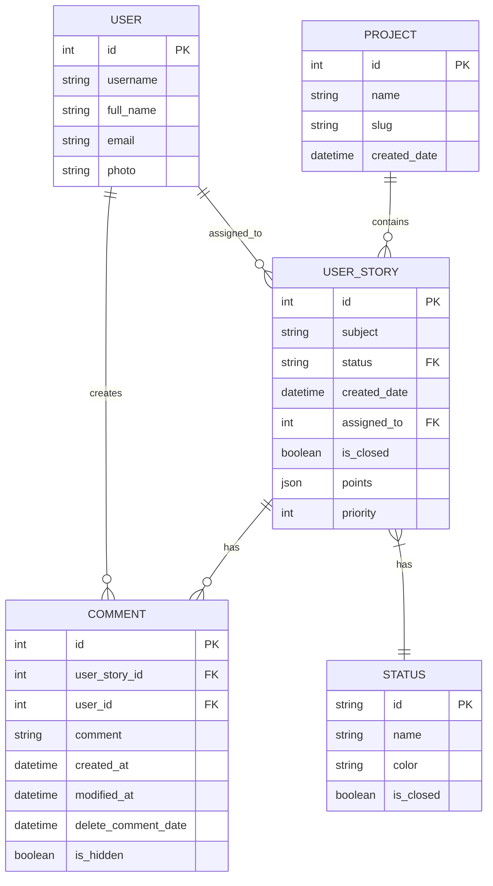

## Diagrama de Entidade Relacionamento

### Relacionamentos

1. **Project - UserStory** (1:N)
   - Um projeto pode ter várias histórias de usuário
   - Cada história pertence a um único projeto

2. **UserStory - Comment** (1:N)
   - Uma história pode ter vários comentários
   - Cada comentário pertence a uma única história

3. **User - Comment** (1:N)
   - Um usuário pode criar vários comentários
   - Cada comentário é criado por um único usuário

4. **User - UserStory** (1:N)
   - Um usuário pode ser designado para várias histórias
   - Cada história pode ser designada a um único usuário

5. **UserStory - Status** (N:1)
   - Várias histórias podem ter o mesmo status
   - Cada história tem um único status

### Restrições

1. **Chaves Primárias**
   - PROJECT: id
   - USER_STORY: id
   - COMMENT: id
   - USER: id
   - STATUS: id

2. **Chaves Estrangeiras**
   - USER_STORY.status -> STATUS.id
   - USER_STORY.assigned_to -> USER.id
   - COMMENT.user_story_id -> USER_STORY.id
   - COMMENT.user_id -> USER.id

3. **Integridade Referencial**
   - Exclusão de PROJECT: Cascade para USER_STORY
   - Exclusão de USER_STORY: Cascade para COMMENT
   - Exclusão de USER: Set null para USER_STORY.assigned_to
   - Exclusão de STATUS: Restrict

4. **Validações**
   - Datas não podem ser futuras
   - Comentários excluídos mantêm registro (soft delete)
   - Status "fechado" implica em USER_STORY.is_closed = true